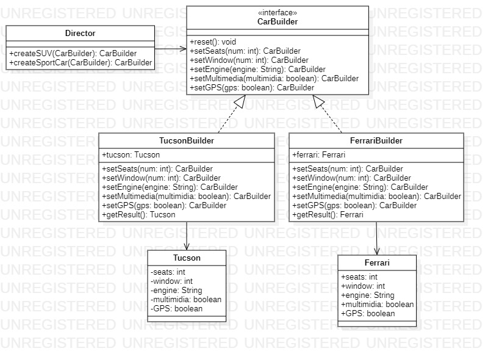

<h1 align="center">Padrão de Projeto</h1>
 <h3 align="center">Builder</h3>
 
 
 
O Builder é um padrão de projeto criacional, voltado a construção de objetos complexos. Tal padrão visa construir o objeto passo a passo para que possamos descentralizar um construtor confuso com inúmeros paramentos e permitindo que o código cliente possa produzir diferentes tipos de representações do mesmo objeto utilizando o mesmo código de construção.
  
    <h4 align="left">Implementação:<h4>
  

1. Temos uma interface englobando métodos comuns em um mesmo objeto.
    <pre><code> 
        public interface CarBuilder {

            public default CarBuilder reset(){
                return null;
            }

            public CarBuilder setSeats(int num);
            public CarBuilder setWindow(int num);
            public CarBuilder setEngine(String engine);
            public CarBuilder setMultimidia(boolean multimidia);
            public CarBuilder setGPS(boolean gps);

        }
    </code></pre>

2. Temos duas classes concretas neste caso, uma classe Ferrari que possui nosso objeto concreto Ferrari em sua implementação "crua" e uma classe FerrariBuilder que implementará a interface CarBuilder que contém nosso padrão em pratica.
    <pre><code> 
        public class Ferrari {

            private String engine;
            private int seats;
            private int window;
            private boolean multimidia;
            private boolean GPS;

            private Ferrari(String engine, int seats, int window, boolean multimidia, boolean GPS) {
                this.engine = engine;
                this.seats = seats;
                this.window = window;
                this.multimidia = multimidia;
                this.GPS = GPS;
            }

            @Override
            public String toString() {
                return "Ferrari{" +
                        "engine='" + engine + '\'' +
                        ", seats=" + seats +
                        ", window=" + window +
                        ", multimidia=" + multimidia +
                        ", GPS=" + GPS +
                        '}';
            }

            public static class FerrariBuilder implements CarBuilder {
                private String engine;
                private int seats;
                private int window;
                private boolean multimidia;
                private boolean GPS;
                private static Ferrari ferrari;

                @Override
                public CarBuilder setSeats(int num) {
                    this.seats = num;
                    return this;
                }

                @Override
                public CarBuilder setWindow(int num) {
                    this.window = num;
                    return this;
                }

                @Override
                public CarBuilder setEngine(String engine) {
                    this.engine = engine;
                    return this;
                }

                @Override
                public CarBuilder setMultimidia(boolean multimidia) {
                    this.multimidia = multimidia;
                    return this;
                }

                @Override
                public CarBuilder setGPS(boolean gps) {
                    this.GPS = gps;
                    return this;
                }

                //troquei getResult para build, assim fica mais intuitivo
                public Ferrari build(){
                    return new Ferrari(engine,seats,window,multimidia,GPS);
                }
            }
        }
    </code></pre>

3. A classe Director irá servir esconder detalhes da construção de um produto para o cliente e para encapsular maneiras de construirmos tipos diferentes, neste caso, possuímos duas formas de construir um carro, através do método createSUV() e createSportCar(), mas dependendo da complexidade do objeto e suas formas de criação, poderíamos ter vários. 
    <pre><code> 
        public class Director {

            public void createSUV(CarBuilder builder){
                builder.setSeats(5)
                        .setWindow(4)
                        .setEngine("2.0l")
                        .setMultimidia(false)
                        .setGPS(false);
            }

            public void createSportCar(CarBuilder builder){
                builder.setSeats(2)
                        .setWindow(2)
                        .setEngine("V12")
                        .setMultimidia(true)
                        .setGPS(true);
            }

        }
    </code></pre>
4. Podemos notar que no método main, especificamos à classe Director como queremos que nosso objeto seja criado passando o nosso objeto ferrariBuilder como parâmetro. Enquanto nosso objeto Ferrari, recebe sua instância através da classe que implementa nosso padrão ferrariBuilder.build(), retornando sua instância final.
    <pre><code> 
        public static void main(String[] args) {
            Ferrari.FerrariBuilder ferrariBuilder = new Ferrari.FerrariBuilder();

            Director director = new Director();

            director.createSportCar(ferrariBuilder);
            Ferrari ferrari = ferrariBuilder.build();
            System.out.println(ferrari);
        }
    </code></pre>

<h2>Diagrama de Classe</h2>

>