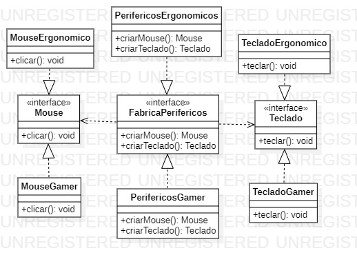

<h1 align="center">Padrão de Projeto</h1>
 <h3 align="center">Abstract Factory</h3>
 
 
 
O padrão Factory busca substituir a forma padrão de criação de um objeto. Porém, no padrão Abstract sua implementação permite que tenhamos grupos de objetos relacionados. Desta forma, garantimos que o cliente possa receber o produto de objetos relacionados.
  
    <h4 align="left">Implementação:<h4>
  

1. Teremos um método que será responsável por retornar os produtos ao nosso objeto, assim como o padrão Factory normalmente, porém, poderemos retornar objetos que estão dentro do grupo.
    <pre><code> 
        public interface FabricaPerifericos {
            public Mouse criarMouse();
            public Teclado criarTeclado();
        }

        public class PerifericosGamer implements FabricaPerifericos{

            @Override
            public Mouse criarMouse() {
                return new MouseGamer();
            }

            @Override
            public Teclado criarTeclado() {
                return new TecladoGamer();
            }
        }
    </code></pre>

Podemos notar que a criação de um Teclado ou mouse é opcional, porém, caso haja esta criação, garantimos que o objeto participem do mesmo grupo.

<h2>Diagrama de Classe</h2>

>