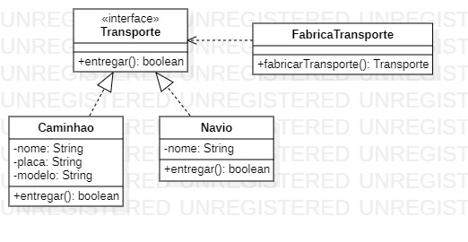

<h1 align="center">Padrão de Projeto</h1>
 <h3 align="center">Factory</h3>
 
 
 
O padrão Factory busca substituir a forma padrão de criação de um objeto! Como o próprio nome diz, teremos um método fabrica que se encarregará de criar produtos (Objetos retornados por um método fábrica geralmente são chamados de produtos) do nosso objeto, criando assim uma fácil manutenção, caso precise adicionar recursos a aplicação.
  
    <h4 align="left">Implementação:<h4>
  

1. Teremos um método que será responsável por retornar os produtos ao nosso objeto.
    <pre><code> 
        public Transporte fabricarTransporte(int i){
            if(i == 1) return new Caminhao();
            if(i == 2) return new Navio();
            return null;
        }
    </code></pre>

2. Para o código cliente a usabilidade continua a mesma, os objetos de Transporte caminhão e navio, ainda possuem o método entregar e toda a lógica contida nos mesmos, porém, a forma que eles recebem sua instância é através da fabrica. 
    <pre><code> 
        public static void main(String[] args) {
            FabricaTransporte fabricaTransporte = new FabricaTransporte();

            Transporte caminhao = fabricaTransporte.fabricarTransporte(1);
            Transporte navio = fabricaTransporte.fabricarTransporte(2);
        

            navio.entregar();
            caminhao.entregar();
        }
    </code></pre>

<h2>Diagrama de Classe</h2>

>