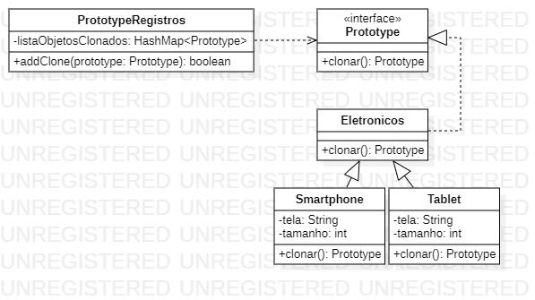

<h1 align="center">Padrão de Projeto</h1>
 <h3 align="center">Prototype</h3>
 
 
 
O Prototype é um padrão de projeto que permite copiar objetos existentes delegando o processo de clonagem para o próprio objeto que está sendo clonado.
  
    <h4 align="left">Implementação:<h4>
  

1. Aqui temos uma interface com o método Clonar. Está interface é utilizada para todos os objetos que quisermos criar uma copia.
    <pre><code> 
        public interface Prototype {
            Prototype clonar();
        }
    </code></pre>

2. Aqui temos uma classe mãe Eletronicos que por sua vez implementa a interface Prototype, portanto Smartphone consegue sobrescrever o método clonar especificando como esta clonagem deve ser feita. 
    <pre><code> 
       public class Smartphone extends Eletronicos{
            public Smartphone(){}
            public Smartphone(Smartphone smartphone) {
                this.tela = smartphone.tela;
                this.tamanhoEmCm = smartphone.tamanhoEmCm;
            }

            @Override
            public Prototype clonar() {
                Smartphone smartphone = new Smartphone(this);
                PrototypeRegistros.getRegistros().addClone(smartphone);
                return smartphone;
            }
        }
    </code></pre>

A implementação está na polimorfia de construtor que recebe um objeto de sua própria classe e faz a clonagem dos respectivos atributos. Esta abordagem está ligada a um dos pilares da orientação a objeto, o encapsulamento! Caso haja um atributo privado, não seria possível acessarmos os mesmo sem criar uma alteração na classe, portanto, para prevenir problemas relacionados, delegamos este trabalho para sua própria classe.

<h2>Diagrama de Classe</h2>

>