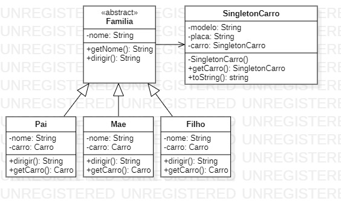

<h1 align="center">Padrão de Projeto</h1>
 <h3 align="center">Singleton</h3>
 
 
 
o Singleton é um padrão de projeto criacional que busca garantir a mesma instância para objetos diferentes.

Para que seja implementando de forma correta, é necessário ater-se a algumas características principais de uma classe que terá o Singleton:
  
1. Construtor deve ser privado (Criando um construtor privado, garantimos que a classe não poderá ser instanciada fora da mesma seguindo o principio de encapsulamento).
    <pre><code> 
        private SingletonCarro(String modelo, String placa) {
            this.modelo = modelo;
            this.placa = placa;
        }
    </code></pre>

2. Deverá ter um campo privado e estático de mesmo tipo da Classe (este objeto estático irá receber uma instância através de um método)
    <pre><code> 
        private static SingletonCarro carro;
    </code></pre>

3. Por fim, teremos um método get que irá garantir acesso global a esta instância.
    <pre><code> 
        public static SingletonCarro getCarro(){
            if(carro == null) return new SingletonCarro("HB20s", "JKL0305");
            return carro;
        }
    </code></pre>

<h2>Diagrama de Classe</h2>

>
