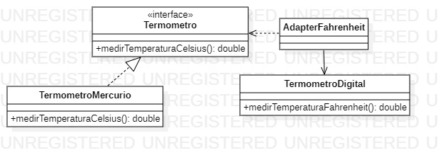

<h1 align="center">Padrão de Projeto</h1>
 <h3 align="center">Adapter</h3>
 
 
 
O Adapter é um padrão de projeto que permite objetos com interfaces incompatíveis colaborarem entre si.
  
    <h4 align="left">Implementação:<h4>
  

1. Aqui temos uma interface com um  método medirTemperaturaCelsius
    <pre><code> 
        public interface ITermometro {
            public double medirTemperaturaCelsius(Pessoa pessoa);
        }
    </code></pre>

2. Como podemos ver, na classe TermometroDigital possuímos um método com assinatura e execução diferente porém com a mesma funcionalidade (Retornar a temperatura de uma pessoa). Como temos duas classes que não conseguem conversar entre si, criamos uma classe Adaptadora que servirá de fonte para nosso código cliente poder utilizar os métodos com funcionalidades parecidas como se fossem o mesmo método.
    <pre><code> 
        public class AdapterFahrenheit extends TermometroDigital implements ITermometro{
            //Adapter de classe
            @Override
            public double medirTemperaturaCelsius(Pessoa pessoa) {
                return super.medirTemperaturaFahrenheit(pessoa);
            }

            /*
                Caso fizessemos um adapter de objeto, a classe TermometroDigital
                não seria uma extensão da Classe Adapter se tornaria um objeto
                e utilizariamos os métodos deste objeto.
                segue o exemplo a baixo;
                public class AdapterFahrenheit implements ITermometro{
                TermometroDigital termometroDigital = new TermometroDigital();
                    @Override
                    public double medirTemperaturaCelsius(Pessoa pessoa) {
                        return termometroDigital.medirTemperaturaFahrenheit(pessoa);
                    }
                }
            */
            }
    </code></pre>

<h2>Diagrama de Classe</h2>

>