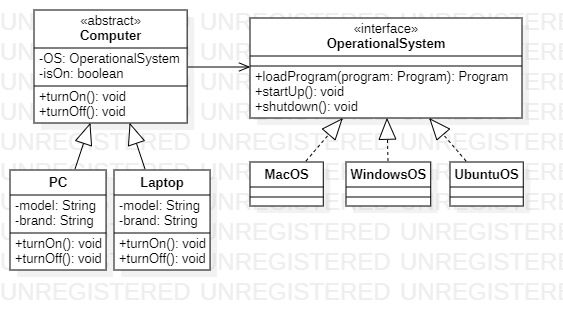

<h1 align="center">Padrão de Projeto</h1>
 <h3 align="center">Bridge</h3>
 
 
 
Bridge é um padrão de projeto estrutural que permite desacoplar a interface de uma classe de sua implementação. Ele é usado quando você quer que sua classe possa ser facilmente estendida sem modificar seu código.

Isso é feito criando uma classe abstrata que define a interface da classe e, em seguida, duas outras classes que implementam essa interface, uma para cada tipo de implementação. A classe abstrata contém uma referência a uma das classes de implementação, que é usada para fazer a ponte entre a interface e a implementação.
  
    <h4 align="left">Implementação:<h4>
  

1. Aqui temos uma classe abstrata que represeta um Computador, que possui um sistema operacional e seus respectivos métodos.
    <pre><code> 
        public abstract class Computer {

            private OperationalSystem os;
            private boolean isOn;

            public abstract void turnOn();
            public abstract void turnOff();
            public abstract boolean installProgram(Program program);
        }
    </code></pre>

2. Interface que representa o Sistema Operacional
    <pre><code> 
        public interface OperationalSystem {

            public Program loadProgram(Program program);
            public Systems compatibility();
            public void startUp();
            public void shutdown();

        }
    </code></pre>

3. Interface de Aplicação
    <pre><code> 
        public interface IApplication {

            public void open();
            public void close();
            public boolean verifyCompatibleSystem(Computer computer);
        }
    </code></pre>

Podemos notar que este código poderia se extender infinitamente cada vez que adicionarmos um novo programa, computador ou sistema operacional por conta da quantidade de combinações possíveis. Portanto, implementando o padrão de projeto Bridge mantemos a personalização dos respectivos objetos sem perder a integridade individual e coesão.

<h2>Diagrama de Classe</h2>

>